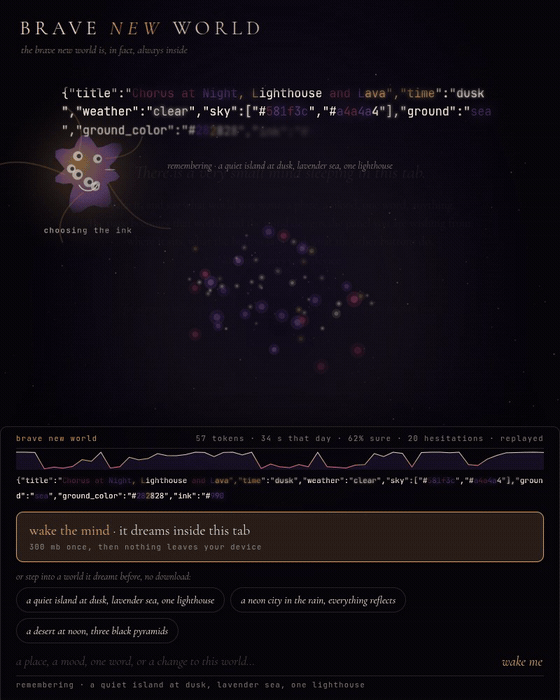
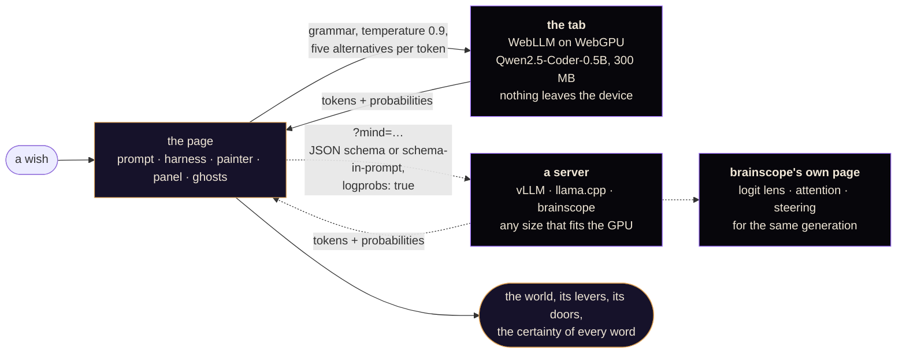

# Brave New World

*The brave new world is, in fact, always inside.*

> ***Dedicated to everyone brave enough to leave the old world, whatever that means for them now.***

I had been reading the Shoggoth debates, and at some point I could not
resist.

So: in your browser lives a small model, and it creates the world on demand.
Not a picture of it. The whole page, and the whole UI. You say "a quiet island
at dusk", or just "sad", or "monday", and the page becomes that world: its
colors, its things, its poem, and the panel you are standing at. Where the
panel sits, what the button says, which levers it hands you, and which doors
lead out of this world into the next one. Then it walks you through.

It is not a chat. Nothing answers you. A world happens to you, and it has
buttons, hung on the things they change. Tap a thing and something happens to
it; tap it again and you walk there. Tap a ghost, the faint thing the model
almost put there, and you walk into the road it did not take. The door out is
a signpost, and the world behind it is being dreamt while you look.

Is it a shoggoth? Is a shoggoth building you a brave new world? Are you
walking through the shoggoth itself? Or was the brave new world inside you all
along?

You might think this is just playful nonsense. Which is, actually, what a
brave new world can be.

A frontier model would do this far better. That was not the point. The point
was to make the edge do it: 0.5 billion parameters, 300 MB once, your own GPU,
and then nothing leaves your browser. Nothing leaves your brave new world.

**Try it:** https://unt1l1f1nd-brave-new-world.static.hf.space

One button wakes the mind. No model to pick, no settings. Before you wake it,
three worlds it already dreamt can be stepped into with nothing downloaded, on
any browser, on a phone.

## What you can do

- **Wish for a world** in a few words, one word, a feeling, another language.
  The page becomes it while the model writes: the sky, the things one by one
  as they are named, the words, then the panel wherever the model put it.
- **Watch it think.** Every token glows in the panel's ribbon and faintly
  across the sky, colored by how sure the model was; hover one for the words
  it almost said.
- **Pull the levers** the model made for this world, hung on the things they
  change: let night fall, more birds, let it storm.
- **Tap a thing** and something happens to it; the sun becomes a moon, the
  cat leaves, the bell stops the wind. Tap it again and you walk into it: the
  camera leans in while the next world is dreamt from there.
- **Tap the empty sky** for a shooting star, the ground to grow something
  where you touched, the title to change the world's hand.
- **Tap a ghost**, the faint thing the model almost placed, and walk into the
  road it did not take.
- **Take the door.** The model's own wish for the next world stands on a
  signpost in the scene, with its price in seconds: 0 when it was already
  dreamt while you looked.
- **Ask for a change** ("make it night", "the same at noon", "take the boat
  away") and the world is edited, not replaced.
- **Tap the creature** for its head: what the grammar decided, what it chose,
  where it doubted, what it nearly said.
- **Keep a picture** of the world, or send it: the link is the whole world,
  ghosts and doubts included, and opens without a download.
- **Turn on the sound**, made in the tab from the world's sky, hour and weather.
- **No GPU?** Three remembered dreams replay on any phone, forming the same way.
- **Nothing leaves your device.** A hidden door points the page at a bigger
  mind on your own server instead.

## How

It is never asked to write HTML; a model this size writes HTML the way a
child draws a house. It fills in a grammar-constrained form: title, two
lines of poem, colors, time, weather, ground, three to six things from a
vocabulary of fifty-three, the design of its own panel (edge, tone, shape,
width, the invitation, the word on the button, up to three levers with a
label in the world's voice and an action it composes), and one door: the
wish for the next world. Every token is a choice, not syntax; a JavaScript
engine paints what it named. The one worked example in the prompt is tuned
to the wish, because a model this small copies whatever example it sees: its
hour, weather and ground follow the wish's plain words, and the rest is drawn
afresh for every wish, so no two wishes are handed the same default world.

The world is the interface. The levers hang on the things they change, the
door stands in the scene as a signpost with its price in seconds (0 when it
was dreamt ahead while you looked), and the panel is a wish line that sits
where the model's words are not. Tap a thing and something happens to it;
tap it again to walk there. Tap a ghost, the faint thing it almost placed,
and it re-walks its own text to that token and turns the other way. Every
world lives in the address bar, doubts included.

While it dreams, its tokens land across the page at the certainty it gave
them; tap the creature for its head: what the grammar decided, what it chose,
where it doubted, what it nearly said. Attention and activations stay inside
the GPU; the page shows less rather than inventing the rest. The long
version, and where it runs, is in [docs/how.md](docs/how.md).

## Evals

Measured, not assumed. `eval.html` runs the shipped prompt, grammar and
sampling over held-out wishes and scores what came back with checks, not
opinions: 32 wishes, 16 vague ones ("hi", "blue", "monday", one in Czech,
one emoji) and 12 edits to a fixed world. On what ships today the 0.5B comes
back clean first try 94% of the time and never dead after one retry, honors
the wish's plain words 88% of the time, and lands 42% of the edits while
keeping 71% of the world. What no column measures is beauty, and the demos
are chosen by eye. The table with every run, the findings, and what was
changed because of them are in [docs/evals.md](docs/evals.md).

## Two minds, one page

The page does not care where the mind is. By default it is in the tab. With
`?mind=http://host:8010/v1` it is any OpenAI-compatible server that streams,
and the page becomes a front for a model that would never fit in a browser.

Why open it:

- **To see what size buys.** The whole piece is built around what a 0.5B can
  and cannot do: it copies the example's panel, it names a change instead of
  making it, it goes home when given nothing. Point the same page, the same
  prompt and the same scorer at a 7B or a 30B on your own GPU and every one
  of those numbers gets a second row. The eval already runs against whatever
  is at `?mind=`.
- **To look deeper than logits.** The tab hands out probabilities and nothing
  else; brainscope hands out the residual stream. With brainscope as the
  mind, the world materializes here while its logit lens, attention and
  per-layer readouts play over there, for the very tokens you are watching
  land. Steering directions apply too: a persona vector on the model that
  dreams the world is a world with a persona.
- **To keep the interface honest.** The panel, the ghosts and the doors
  remain the page's; only the mind moves. If a bigger mind makes better
  levers, it shows up in the levers, not in a prompt trick.

A schema-aware server (vLLM, llama.cpp) gets the world's schema as a
decoding constraint; brainscope gets it in the prompt (`&guided=0`) and the
harness keeps the rest. brainscope needs `--cors` and streaming with
logprobs, which it grew for this: `brainscope --model <id> --cors`, then
`?mind=http://host:8010/v1&guided=0`. Nothing on the page changes; the wake
button says where the wishes go.

## The rest

- `world.js` the vocabulary, the grammar, the painter, the levers, the surprises
- `mind.js` the contract, the harness, the scorer, the wish sets
- `console.js` the one element the model does not write, though it designs it
- `demos.js` three recorded dreams, written by `tools/record-demos.mjs`, never by hand
- `eval.html` the models, the wishes, one table; results in `evals/`, findings in `docs/evals.md`
- `tools/` drive, film, stills, serve, deploy

## The title

Huxley's brave new world was a place where everything had been decided for
everyone, comfortably, by something larger than any of them, and nobody
asked. This one is the reverse. It is made by a mind too small to be sure of
anything, its doubts are drawn on the page for you to read, nothing appears
that you did not wish for, and every world has a door out. Miranda said the
words first, in The Tempest, looking at the first people she had ever met who
were not her father: "O brave new world, that has such people in it." She
meant it. Huxley did not. This page would like to mean it again.
