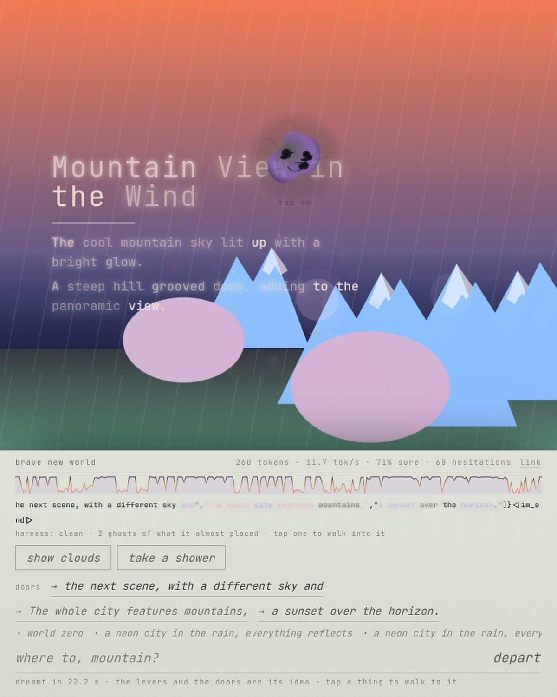
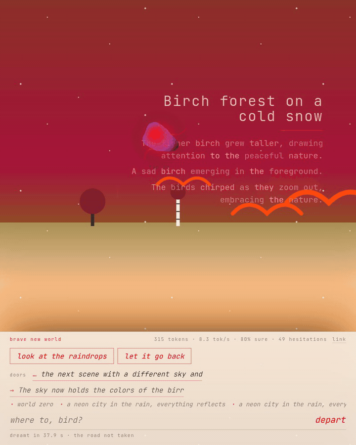

# Brave New World

*The brave new world is, in fact, always inside.*

I had been reading the Shoggoth debates and listening to the world-model
talks, and at some point I could not resist.

So: in your browser lives a small model, and it creates the world on demand.
Not a picture of it. The whole page, and the whole UI. You say "a quiet island
at dusk", or just "sad", or "monday", and the page becomes that world: its
colors, its things, its poem, and the panel you are standing at. Where the
panel sits, what the button says, which levers it hands you, and which doors
lead out of this world into the next one. Then it walks you through.

It is not a chat. Nothing answers you. A world happens to you, and it has
buttons. Tap a thing and you walk to it. Tap a ghost, the faint thing the
model almost put there, and you walk into the road it did not take. The door
it thinks you will choose is already being dreamt while you look.

Is it a shoggoth? Is a shoggoth building you a brave new world? Are you
walking through the shoggoth itself? Or was the brave new world inside you all
along?

You might think this is just playful nonsense. Which is, actually, what a
brave new world can be.

A frontier model would do this far better. That was not the point. The point
was to make the edge do it: 0.5 billion parameters, 300 MB once, your own GPU,
and then nothing leaves your browser. Nothing leaves your brave new world.

**Try it:** https://unt1l1f1nd-brave-new-world.static.hf.space

One button wakes the mind. No model to pick, no settings. Before you wake it,
three worlds it already dreamt can be stepped into with nothing downloaded, on
any browser, on a phone.

## How, given that the model is very small

It isn't asked to write HTML. A model this size writes HTML the way a child
draws a house. It is asked to fill in a form: a grammar-constrained JSON spec
with a title, two lines of poem, colors, time, weather, ground, three to six
things from a vocabulary of fifty-three, the design of its own console (side,
tone, shape, width, the invitation in the input, the word on the button, one
to three levers with a label in the world's voice and an action it composes),
and one to three doors: short wishes for the world you might want next.
Every token it produces is a choice, not syntax, because the syntax is enforced
by the sampler. A JavaScript engine then paints what it named, properly. The
model decides everything you see; the drawing of a lighthouse is ours.

The buttons do things. The model names a lever and composes what it does,
under the grammar: `set time night`, `set weather rain`, `add whale`, `more
bird`, `fewer cloud`, `undo`, `again`, `elsewhere`. Every combination is legal
by construction and the engine knows them all, so whether a lever called
"hush" really sets the motion still is the model's design decision, and the
eval scores it. The doors are wishes: press one and the mind dreams it, with
the world you are in still in its context, so "the same island at night" is
an edit and "a desert" is a departure. Anything you type works the same way:
a place, a mood, a single word, a change to what is on screen, another
language. What comes back is always a world, because the grammar allows
nothing else; whether it is a good one is what the evals measure.

The world is walkable, as far as this much model allows. Tap a thing in the
scene and you wish to walk to it. Tap a ghost, the faint thing the model
almost placed, and it regenerates the world from that very token with the
other choice: a grammar whose root is the model's own text up to the fork,
verbatim, then the road not taken. In the forked world, what it chose the
first time is the ghost. The scene shifts a little under the pointer or the
phone's tilt, far things less than near ones.

The doors are the next probable world, literally. Each carries the model's
certainty of it, drawn as its weight, and the one it believed in most is
dreamt ahead on the idle GPU while you look at this one. Step through it and
the world is already there; take any other road and the head start is thrown
away. The world after this one exists before you choose it, at the
probability the model gave it.

Every world lives in the address bar. The hash holds the spec, the model's
text, a byte of certainty per token and the ghosts, so a link opens the exact
dream on any browser with nothing downloaded, levers included. The `link`
in the panel copies it, or hands it to the phone's share sheet.

## The insides

While it dreams, every token lands large across the page, glowing with the
probability the model gave it; hovering (or tapping) one shows the words it
almost said. Where the model hesitated over *what* to put in the scene, the
runner-up is drawn too, faintly, at the probability it almost had. Those are
ghosts of the world you nearly got, and you can walk into one. The words on
the page are drawn at the certainty they were written with.

The creature drifting about is the model's state. It writhes while thinking,
opens an eye at every hesitation, and says what it is thinking about, read
off the text so far: finding a title, mixing the sky, naming the third thing,
wording a lever, opening the doors. Tap it and its head opens: how many
tokens the grammar decided and how many were its own choices, how sure it was
on those, where it doubted most, part by part, the places it nearly said
something else and what, and what the mind is made of (24 layers, 14 heads,
896 wide, a vocabulary of 151,936, 4-bit weights).

What it says about itself is all of that: the probability of every token it
wrote and of the words it did not. Its attention and activations stay inside
the GPU; WebLLM does not hand them out. Showing them would take a second copy
of the model through a custom ONNX export, and until then this page shows
less rather than inventing the rest.

## Runs where

The mind needs WebGPU: Chrome and Edge on desktop and Android, Safari 26 on
Mac, iPhone and iPad, and Firefox where it has shipped WebGPU. A GPU without
16-bit shaders gets the same model in its f32 build. On Linux Chrome needs
`chrome://flags/#enable-unsafe-webgpu` and `#enable-vulkan`. Without WebGPU
the three remembered dreams still work, levers included: they are real runs,
recorded token by token, replayed without a model.

The model is loaded through [WebLLM](https://github.com/mlc-ai/web-llm) with
grammar-constrained decoding and per-token log probabilities, which is why it
is not the transformers.js path used in
[coalescence](https://github.com/moudrkat/coalescence): that path has no
grammar and no logprobs, and this piece is nothing without either. The loading
is the same idea: one button that says what it costs, a promise-guarded
download, cached for the next visit.

## Evals

`eval.html` runs every candidate model over the same wishes with the prompt,
grammar and sampling the app ships with, and scores what came back: whether a
spec parsed, whether the prose held together, how much of the vocabulary and
palette it used, whether the world matches the wish, whether the levers' labels
say what they do, whether the doors lead somewhere other than back. Three sets:

- `?set=wishes`: 32 held-out wishes, none in the prompt.
- `?set=ambiguous`: 16 wishes people actually type: "hi", "sad", "blue",
  "monday", one in Czech, one emoji, "the opposite of this".
- `?set=followups`: 12 edits to a fixed prior world ("make it night", "add a
  whale"); scored on whether the asked change happened and how much of the
  world survived.

Results for the shipped model are in `evals/2026-09-19-*.md`; the full JSON
(specs, tokens, issues) sits next to them, gitignored for size.

| mind | set | example | tok/s | broken | dead | sense | original | prose | levers | doors | edit | kept | total |
|---|---|---|--:|--:|--:|--:|--:|--:|--:|--:|--:|--:|--:|
| Qwen2.5 Coder · 0.5B, shipped | wishes | full | 12 | 12% | 12% | 0.42 | 0.50 | 0.97 | 0.64 | 1.00 | · | · | 0.89 |
| Qwen2.5 Coder · 0.5B | ambiguous | full | 13 | 25% | 19% | 0.00 | 0.33 | 0.98 | 0.75 | 0.92 | · | · | 0.86 |
| Qwen2.5 Coder · 0.5B | followups | full | 15 | 0% | 0% | 0.78 | 0.92 | 1.00 | 0.83 | 0.99 | 0.33 | 0.86 | 0.88 |
| Qwen2.5 Coder · 0.5B | wishes | prose | 14 | 12% | 9% | 0.45 | 0.41 | 0.98 | 0.19 | 0.99 | · | · | 0.87 |
| Qwen2.5 Coder · 0.5B | wishes | bare | 15 | 69% | 62% | 0.41 | 0.38 | 0.86 | 0.10 | 0.98 | · | · | 0.88 |

broken: first attempts the harness sent back (not language, or no spec); dead: still broken after the eval's one retry (the app retries twice). sense: the world matches what the wish plainly says; original: not the prompt example's colors, things or words; prose: readable strings; levers: label says what the composed action does (lower bound); doors: lead away from the wish and each other; edit/kept: follow-ups only, asked change made / share of the prior world preserved.

One finding worth more than the table. Shown a worked example in the prompt,
the model designs the world and plagiarizes the panel: on the final grammar,
27 of 32 consoles used one of the three examples' consoles, label for label
("fold", "unfold", "more houses"). Take the console out of the example and
the copying stops entirely, and so does the model's ability to write one: 22
of 32 first attempts were not language. Describe one example console in prose
instead of JSON and the copying halves, but the levers stop meaning what they
say (label matches action 0.19 against 0.64). So the example ships, the doors
are mostly its own (12 of 77 copied), and the number stays in this paragraph.
The tighter grammar for short strings (a letter first, plain characters after)
came out of the bare run's failures and stayed.

Vague wishes show the same reflex from the other side. On the 16 wishes people
actually type ("hi", "sad", "blue", "monday", one in Czech, one emoji), it
made 14 different worlds, 25% needed a second attempt and 19% were still not
language after it; and 5 of the 16 were the prompt example's own world
wearing a new sky: "hi" got "Platform Nine, Vermilion", "somewhere warm" got
the jazz bar under the sea. A small model with nothing to go on goes home.

Edits are the other honest number. Asked for a change to the world on screen
("make it night", "add a whale", "snow instead"), it keeps the world, 0.86 of
it on average, and makes the asked change 4 times in 12. The other times it
names the change instead of making it: the title becomes "Snow instead" and
the weather stays clear, "Typewriter Letters" over the same serif. That is
why the levers exist and why the engine, not the model, pulls them: the model
decides what a lever is for, and that it does reliably (0.83 of labels match
their composed action on the follow-up set).

## The rest

- `world.js`: the vocabulary, the grammar, the painter, the levers.
- `mind.js`: the contract, the harness, the scorer, the wish sets.
- `console.js`: the one element the model does not write, though it designs it.
- `demos.js`: three recorded dreams, written by `tools/record-demos.mjs`, not by hand.
- `eval.html`: the models, the wishes, one table. Results in `evals/`.
- `tools/`: `drive.mjs` runs the app or the eval from a shell through Chrome;
  `film.mjs` records the real page for a post; `serve.py` serves without caching.

Prior art, for the curious: Google's Generative UI, Anthropic's Imagine with
Claude and OpenUI's OUI-1 all have a large model write the interface on a
server; Vercel's json-render and Google's A2UI are the same
catalog-and-spec idea for dashboards; Loom is the ancestor of the ghosts. None
of them put the model in the tab, none let it design its own panel from a
grammar, and none draw its uncertainty into the picture.

Dedicated to everyone brave enough to leave the old world, whatever that means
for them now.
